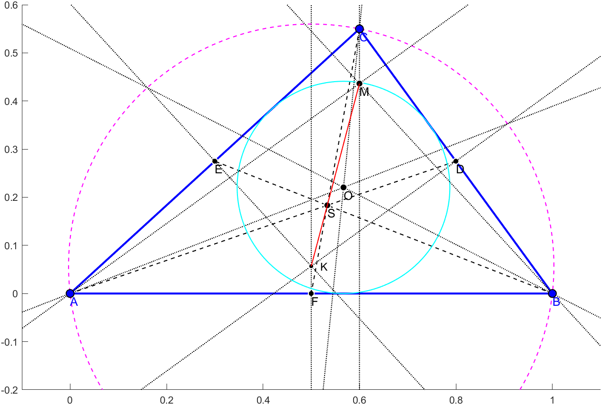

# Geomatplot

Geomatplot is a Matlab interactive plot library similar to Geogebra.

## Main features

1. Easy to use **interactive** geometry library for Matlab
2. Efficient update through the dependency graph
3. User defined callback functions for programming

## Requires
1. Image Processing Toolbox
2. Mapping Toolbox (for intersection)

## Geogebra-like example
```matlab
clf; g = Geomatplot; ylim([-0.2 0.6]); xlim([-.1 1.1]);
A = Point([0.0 0.0]);     % draggable point, automatically labelled A
B = Point([1.0 0.0]);     % automatic labels are applied if no label is given
C = Point([.6 .55]);
ab = Segment(A,B,'b',2);  % a blue segment from A and B
bc = Segment(B,C,'b',2);  %         with LineWidth of 2
cd = Segment(C,A,'b',2);

Segment(A,Midpoint(B,C),'--');
Segment(B,Midpoint(C,A),'--');
Segment(C,Midpoint(A,B),'--');
S=Midpoint('S',A,B,C,'k',7); % Barycenter of the triangle labelled S

PerpendicularBisector(A,B,':');
PerpendicularBisector(B,C,':');
PerpendicularBisector(C,A,':');
[~,K] = Circle(A,B,C,'m--'); % Magenta dashed circumcircle of the triangle

la = AngleBisector(A,B,C,':');
lb = AngleBisector(B,C,A,':');
lc = AngleBisector(C,A,B,':');
Circle(Intersect('O',la,lb),ab,'c'); % (inscribed) circle touching segment AB

ma = PerpendicularLine(A,B,C,':');
mb = PerpendicularLine(B,C,A,':');
mc = PerpendicularLine(C,A,B,':');
M = Intersect('M',ma,mb);
Segment(M,K,'r');
```


## 2D sphere trace visualization

```matlab
clf; g = Geomatplot; xlim([-1.5 1.3]); ylim([0 1.7]); disp Polygon

% You can move, create, delete vertices of the following polygon:
f = Polygon([-1 0;1 0;1 1;0.7 0.7;0.3 0.5;0 0.9;-0.5 0.3;-1 0.3],'b');

p0 = Point('p0',[-.8,1.0 ],'r');
q0 = Point('q0',[.5 ,1.05],'r',5);
v0 = (q0-p0)/Distance(p0,q0); % Operators: point-point=vector, vector/scalar = vector
Ray(p0,q0,'r',1.5);

p = p0; n=10; % Sphere tracing illustration:
for i = 1:n
    d = Distance(p,f); % distance to polygon yields a dependent scalar value
    Circle(p,d,'Color',[i/n 1-i/n 0]);
    p = p + v0*d;      % vector*scalar=vector, point+vector=point
end
```


## Parametric curve and 2D function visualization
```matlab
clf; g = Geomatplot; disp Image
b0 = Point('b0',[0.1 0.2],'r'); % draggable control points
b1 = Point('b1',[0.7 0.9],'r'); % with given labels
b2 = Point('b2',[0.9 0.2],'r');
c1 = Point('c1',[-.5 0],'k','MarkerSize',5); % adjustable corner
c2 = Point('c2',[1.5 1],'k','MarkerSize',5); %   for the image

% parametric callback with t in [0,1] and dependent variables:
bt = @(t,b0,b1,b2)  b0.*(1-t).^2 + 2*b1.*t.*(1-t) + b2.*t.^2;
b = Curve(b0,b1,b2,bt,'r',2); % A red quadratic Bézier curve

Image(b0,b1,b2,@dist2bezier,c1,c2); colorbar;
% where 'dist2bezier' is a (x,y,b0,b1,b2) -> real function

P = Point('P',[.5 .4],'y');
Circle(P,b,'y');
```


## Query data (WIP)

From the previous example, `disp(g)` produces the output below. Dependent objects (they start with a 'd') measure their own callback excecution time, while the movable points measure the time to execute all objects that depend on it. While dragging, render resolutions are lowered to increase responsiveness.
```
>> disp(g)
Geomatplot with 6 movable and 4 dependent plots:
   label : type    runtime    mean pos   |   labels : callback                                         
    'b0' : mpoint  258.03ms [0.08 0.21]  |          :                                                  
    'b1' : mpoint  248.32ms [0.64 0.91]  |          :                                                  
    'b2' : mpoint  256.81ms [0.94 0.18]  |          :                                                  
    'c1' : mpoint  234.01ms [-0.50 0.00] |          :                                                  
    'c2' : mpoint  234.47ms [1.48 0.99]  |          :                                                  
     'P' : mpoint   0.54ms  [0.51 0.40]  |          :                                                  
'curve1' : dcurve   0.43ms  [0.55 0.43]  | b0,b1,b2 : Curve/internalcallback                           
'image1' : dimage  234.01ms [0.49 0.49]  | b0,b1,b2 : Image/internalcallback                           
     'b' : dscalar  0.24ms     [0.14     | P,curve1 : dist_point2polyline                              
     'a' : dcircle  0.30ms  [0.51 0.40]  |      P,b : @(t,c,r)c.value+r.value*[cos(2*pi*t),sin(2*pi*t)]
  Methods, Events, Superclasses
```

## Further examples
The `examples/bez.m` produces the following:


## Design principles

1. Common geometry should be easy to define
2. Responsive interaction, fast callbacks
3. User callbacks for advanced programmable applets

## Credits

Geomatplot is developed by Csaba Bálint and Róbert Bán at Eötvös Loránd University, Budapest, Hungary.