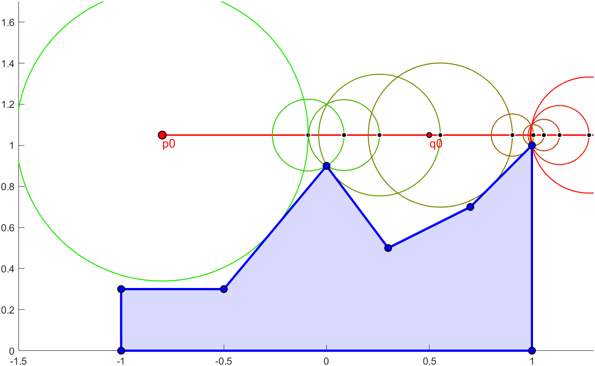

# Geomatplot

Geomatplot is a Matlab interactive plot library similar to Geogebra.

## Main features

1. Easy to use **interactive** geometry library for Matlab
2. Efficient update through the dependency graph
3. User defined callback functions for programming

## Requires
1. Image Processing Toolbox
2. Mapping Toolbox (only for some intersections)
3. Parallel Computing Toolbox (only for faster Image rendering)

## Geogebra-like example
```matlab
clf; disp Triangle

A = Point([0.0 0.0]);     % draggable point, automatically labelled A
B = Point([1.0 0.0]);     % automatic labels are applied if no label is given
C = Point([0.6 .55]);
ab = Segment(A,B,'b',2);  % a blue segment from A and B
bc = Segment(B,C,'b',2);  %         with LineWidth of 2
cd = Segment(C,A,'b',2);

Segment(A,Midpoint(B,C),'--')
Segment(B,Midpoint(C,A),'--')
Segment(C,Midpoint(A,B),'--')
S=Midpoint('S',A,B,C,'k',7);        % Barycenter of the triangle labelled S

PerpendicularBisector(A,B,':')
PerpendicularBisector(B,C,':')
PerpendicularBisector(C,A,':')
[~,K] = Circle(A,B,C,'m--');        % Magenta dashed circumcircle of the triangle
Text(K,"K") % add text at position

la = AngleBisector(A,B,C,':');
lb = AngleBisector(B,C,A,':');
lc = AngleBisector(C,A,B,':');
Circle(Intersect('O',la,lb),ab,'c');% (inscribed) circle touching segment AB

ma = PerpendicularLine(A,B,C,':');
mb = PerpendicularLine(B,C,A,':');
mc = PerpendicularLine(C,A,B,':');
M = Intersect('M',ma,mb);
Segment(M,K,'r')                    % Euler line

ylim([-0.2 0.6]); xlim([-.1 1.1])
```


## 2D sphere trace visualization

```matlab
clf; disp 'Sphere Trace'

% You can move, create, delete vertices of the following polygon:
f = Polygon([-1 0;1 0;1 1;0.7 0.7;0.3 0.5;0 0.9;-0.5 0.3;-1 0.3]);

p0 = Point('p0',[-.8,1.05],'r');    % ray start
q0 = Point('q0',[.5 ,1.05],'r',5);  % ray 'direction'
v0 = Eval((q0-p0)/Distance(p0,q0)); % Operators: point-point=vector, vector/scalar = vector
Ray(p0,v0,'r',1.5)

p = p0; n=10; % Sphere tracing illustration:
for i = 1:n
    d = Distance(p,f); % distance to polygon yields a dependent scalar value
    Circle(p,d,'Color',[i/n 1-i/n 0])
    p = (p + v0*d)';   % vector*scalar=vector, point+vector=point, ' same as Eval
end

xlim([-1.5 1.3]); ylim([0 1.7])
```


## Parametric curve and 2D function visualization
```matlab
clf; disp 'Curve & Image'
b0 = Point('b0',[0.1 0.2],'r'); % draggable control points
b1 = Point('b1',[0.7 0.9],'r'); % with given labels
b2 = Point('b2',[0.9 0.2],'r');

% parametric callback with t in [0,1] and dependent variables:
fun = @(t,b0,b1,b2)  b0.*(1-t).^2 + 2*b1.*t.*(1-t) + b2.*t.^2;
Curve(b0,b1,b2,fun,'r',2);  % A red quadratic Bézier curve

P = Point('P',[.5 .4],'y'); % dist2bezier takes complex values, need to convert:
dist2bezierReal = @(P,A,B,C) dist2bezier(complex(P(1),P(2)),complex(A(1),A(2)),complex(B(1),B(2)),complex(C(1),C(2)));
d = Scalar(P,b0,b1,b2,dist2bezierReal); % dependent scalar value
Circle(P,d,'y'); Text(P,d)  % Tangent circle to a curve and radius as text

c1 = Point('c1',[-.25 0],'MarkerSize',5); % adjustable corners
c2 = Point('c2',[1.25 1],'MarkerSize',5); % for the image domain

Image(b0,b1,b2,@dist2bezier,c1,c2,Device='GPU',CallbackType='vectorize');
% Where 'dist2bezier' is a (z,b0,b1,b2) -> real function with complex inputs.
% Image supports CPU and GPU execution with or without input vectorization 
% similar to arrayfun. Also accepts real inputs eg.: (x,y,b0,b1,b2) -> real.
% There are limitations and performance considerations, see help for details.

colorbar; xlim([-.25 1.25]); ylim([0 1]) 
```


## Query data (WIP)

From the previous example, `disp(g)` produces the output below. Dependent objects (they start with a 'd') measure their own callback excecution time, while the movable points measure the time to execute all objects that depend on it. While dragging, render resolutions are lowered to increase responsiveness.
```
>> Geomatplot.summary
Geomatplot with 6 movable and 5 dependent plots:
   label : type    move/stop time    value/mean pos    | callback                                          
    'b0' : mpoint  31.91ms/38.89ms     (0.1,0.356)     |                                                   
    'b1' : mpoint  15.30ms/33.11ms    (0.642,0.93)     |                                                   
    'b2' : mpoint  19.73ms/27.82ms    (0.914,0.276)    |                                                   
     'P' : mpoint   1.27ms/1.30ms     (0.518,0.398)    |                                                   
    'c1' : mpoint   0.00ms/0.00ms       (-0.25,0)      |                                                   
    'c2' : mpoint   0.00ms/0.00ms       (1.25,1)       |                                                   
'curve1' : dcurve   0.47ms/0.44ms     [0.552,0.52]     | Curve/internalcallback(b0,b1,b2)                  
 'scal1' : dscalar  0.23ms/0.21ms        0.22167       | Scalar/internalcallback(P,b0,b1,b2)               
 'circ1' : dcircle  0.28ms/0.31ms  c=(0.52,0.4) r=0.22 | f(P,scal1) f=@(t,c,r)c+r*[cos(2*pi*t),sin(2*pi*t)]
  'txt1' : dtext    0.47ms/0.37ms     "   0.22167"     | Text/text_varPos_printDrawing(P,scal1)            
'image1' : dimage  19.58ms/34.31ms      [0.5,0.5]      | Image/img_gpu_cplx_arrayfun(b0,b1,b2)             
  Methods, Events, Superclasses
```

## Further examples
The `examples/bez.m` produces the following:


## Design principles

1. Common geometry should be easy to define
2. Responsive interaction, fast callbacks
3. User callbacks for advanced programmable applets

## Credits

Geomatplot is developed by Csaba Bálint and Róbert Bán at Eötvös Loránd University, Budapest, Hungary.